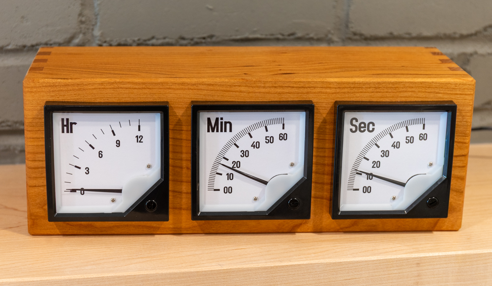

# voltmeter_clock
This repo contains source code and description for a voltmeter clock build.

Substantial credit is given to lcamtuf for [his excellent blog post write up](https://lcamtuf.substack.com/p/a-nicer-voltmeter-clock) that inspired this build. The source code is largely based on lcamtuf's original code, with some modifications as described here.

## Build Information

* Parts summary:
* MCU: AVR128DA28
* Crystal:  8 MHz crystal (ECS-80-18-4X-CKM)
* Voltage Regulator: LM2596
* Digital volt meters: 6C2 0-5V Analog Volt Meters
* 9V DC wall wart power supply
* Wood frame: cherry wood with Danish Oil finish
* Basic pushbuttons for hour, minute setting
* Protoboard for circuit

This MCU used in this clock is a AVR128DA28 as described in the blog post. The MCU can be programmed with a dedicated programmer, but I used an Arduino UNO to do so. To do this, I used the Arduino IDE with [DXCore](https://github.com/SpenceKonde/DxCore), and flashing [jtag2udpi](https://github.com/ElTangas/jtag2updi) on the UNO to allow it to act as a programmer. The code can then be flashed via the Arduino IDE.

The circuit diagram for the clock is reproduced below from the original blog post:

I used a random 9V wall wart power supply to power the clock and used an adjustable voltage regulator to step it down to 5V. I used an adjustable regulator as I found supplying exactly 5V to the MCU wasn't sufficient to for volt meters to hit the max of their 5V range when driven by the MCU. Through trial and error, I adjusted the voltage input to the MCU until a volt meter hit it's max 5v position, and this took approximately 5.25V input.

## Code Modification's
Compared to lcamtuf's original code the following broad mdofications were made. AI tools were partially used to aid the source code modifications.
* The primary PWM loop driving the voltmeters in the original implementation ran roughly at single digit KHz rates. I found this caused an audible high frequency hum from the voltmeters that I did not find acceptable. The PWM driving loop speed was increased to 100 KHz (ultrasonic) which eliminated the human audible noise.
* By running the PWM loop faster, however, the possible PWM resolution decreased to 80 steps. This would cause jerky movements on the second hand if used as-is. To smooth the voltmeter motion back out, a sigma-delta dithering approach was used to artificially emulate a higher step resolution.
* Functionality was added so that the second-hand falls back more gradually on minute wrap-arounds (to avoid an audible click noise). This function is skipped on hour wrap-arounds, as this then kind of acts like a chime to make one aware of the top of an hour
